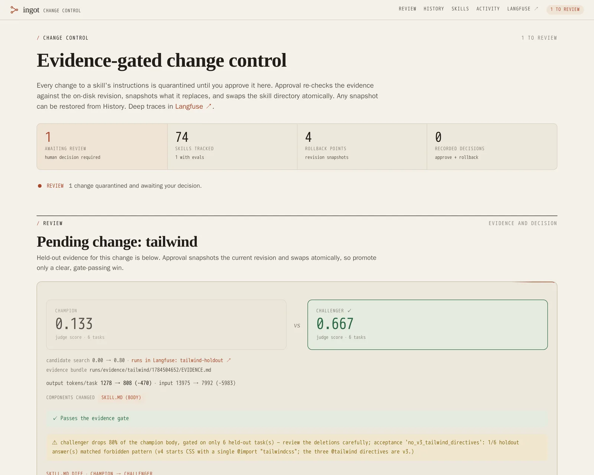

# Ingot

**Evidence-gated change control for agent instructions.**

[](https://github.com/SlanchaAI/ingot/actions/workflows/ci.yml) [](LICENSE) [](Dockerfile) [](docker-compose.yml)

**Ingot is a local-first control plane for AI agent skills.** It routes each task to versioned
instructions and keeps every proposed rewrite quarantined until a person reviews the evidence and
approves promotion. It is built for individual developers running MCP-compatible agents who want
skill reuse without giving an optimizer permission to change live instructions.

<p align="center">
  
</p>

Unlike a skill registry or prompt optimizer alone, Ingot connects serving, evaluation, and change
control. Every served revision has a content hash. Candidate changes carry held-out evidence.
Approval snapshots the previous revision, promotes atomically, and records the decision.

What the system guarantees:

- **A revision names an exact skill.** Every file in a skill folder is hashed, so the revision on a
  trace, in a piece of evidence, and on disk are comparable.
- **Changes are quarantined.** Generated rewrites land in `runs/pending/` and cannot route
  traffic until a human approves them.
- **Approval needs evidence.** A rewrite carries held-out champion-vs-challenger scores, per-case
  deltas, token cost, and a gate verdict; promotion re-checks the evidence still matches disk.
- **Promotion is atomic and reversible.** The displaced revision is snapshotted and the directory
  swapped by rename; restore any snapshot from the UI or CLI.
- **Decisions are audited.** Approvals, rejections, and rollbacks append metadata-only records (action, skill,
  revision, actor, timestamp, and an optional rejection reason), never skill text or credentials.

Designed for one trusted operator by default:

- **Batteries included.** `docker compose up` starts the router, the change-control UI, and a
  self-hosted Langfuse for traces and experiments. An included Compose override connects Cloud or
  another self-hosted Langfuse without starting the bundled stack.
- **Local or hosted inference.** Point it at Ollama or vLLM and no model traffic leaves your
  machine. Hosted calls use OpenRouter with zero-data-retention routing enforced on every
  request.
- **Localhost boundary.** The default stack binds to localhost. The change-control UI has a
  password gate by default, but the MCP endpoint has no built-in authentication. Harden the
  deployment before sharing it beyond one trusted machine.
- **Easy.** A skill is a folder with a `SKILL.md`. Drop one in and it is live on the next request.

SkillOpt is a central part of Ingot's value: it turns weak real-world runs into bounded instruction
edits, validates them against held-out tasks, and produces evidence-backed proposals. Running an
optimization is always an operator choice, and SkillOpt can propose but never activate a change.

<p align="center">
  
</p>

[Quickstart](#quickstart) · [Tutorial](docs/tutorial.md) · [How it works](docs/how-it-works.md) ·
[Configuration](docs/configuration.md) · [Architecture](ARCHITECTURE.md) ·
[Production setup](PRODUCTION_SETUP.md) ·
[Contributing](CONTRIBUTING.md) · [Security](SECURITY.md) · [MIT license](LICENSE)

## Quickstart

### Prerequisites

- Git and Docker with Docker Compose.
- Free localhost ports `8000`, `8080`, and `3100`.
- Free Docker storage for the multi-container Langfuse stack. Check current usage with
  `docker system df` before the first pull.
- An OpenRouter API key, or an OpenAI-compatible local endpoint such as Ollama or vLLM, for the
  demo agent response. Without one, the services still start and the agent prints configuration
  guidance.

Clone the repository, choose the inference settings in `.env`, fetch the Anthropic skill source,
and start the stack in the background:

```bash
git clone https://github.com/SlanchaAI/ingot.git && cd ingot
cp .env.example .env               # add an OpenRouter key, or point BASE_URL at Ollama or vLLM
docker compose version
docker system df
scripts/fetch_skills.sh anthropics # third-party skills; review their instructions and licenses
docker compose up -d --build       # router (:8000), UI (:8080), and Langfuse (:3100)
docker compose ps
docker compose run --rm agent "How do I merge several PDFs into one and add page numbers?"
```

The run should include these markers. The model, revision, token counts, and answer will vary:

```text
COMPATIBLE ROUTE (MCP route_and_load):
    ... pdf: Use this skill whenever the user wants to do anything with PDF files...

LOADED SKILLS (MCP route_and_load): ['pdf@...']

RESULT:
... working PDF code following the loaded skill ...
```

The `pdf@...` line is the first-value signal: Ingot selected and loaded an exact approved skill
revision before the model answered. Open `http://localhost:8080` to see the served skills and their
revisions. The default login is **`admin` / `ingot`**.

The fetched skills are third-party dependencies, not audited or redistributed by Ingot. The
single-source command keeps the first run smaller; use `scripts/fetch_skills.sh all` only after
reviewing the sources and licenses in [Skill sources](docs/skill-sources.md).

If startup fails:

- `address already in use` means one of the required localhost ports is occupied. Stop that service
  or change the matching port mapping before retrying.
- Docker storage errors require freeing or expanding Docker's allocated storage. Inspect usage with
  `docker system df`.
- Use `docker compose logs --tail=100` for service errors and `docker compose down` to stop the
  stack.

Change `AUTH_PASSWORD` in `.env` before sharing the UI on your LAN. To run without a login, set
`AUTH_MODE=open` explicitly. See [Privacy & security](docs/security.md#network-exposure) for the
network boundary and TLS options.

### Deployment boundary

Ingot's default Compose stack is for local development, not hardened multi-tenant operation. The
MCP endpoint has no built-in authentication, and optimizer services that launch execution
sandboxes mount the Docker socket. Keep the default services on localhost, treat fetched skills as
code, and do not give agent containers sensitive host mounts. For a shared deployment, follow the
[Production setup](PRODUCTION_SETUP.md) and the full [Security policy](SECURITY.md).

`docker compose up` brings up a self-hosted Langfuse (traces + experiment UI) alongside the router
and UI; trace mining reads from it and has no local fallback, so it fails loudly if no
Langfuse-compatible backend is reachable. To send traces to your own Langfuse without starting the
bundled containers, set `LANGFUSE_*` and use `docker-compose.external-langfuse.yml` as documented in
[Configuration](docs/configuration.md#using-your-own-langfuse-project). Backend, model, and gate
settings live in [Configuration](docs/configuration.md).

Then walk through the full loop, from mining a stale Tailwind skill through promotion, in the
[**Tutorial**](docs/tutorial.md).

For a hardened open-source Langfuse deployment with agents on other LAN machines, follow
[Production setup](PRODUCTION_SETUP.md).

### Connect Claude Code or Codex

You can use Ingot with your existing coding agent instead of the bundled demo agent. Start the
stack, then run the setup script for your agent. The Codex connector requires Codex 0.128 or newer,
Node.js 22 or newer, and Python 3. The Claude Code connector requires `uv` (recommended), or
Python 3.10 or newer with `pip` and the Langfuse 4.x SDK:

```bash
# macOS, install only the dependencies your selected agent needs
brew install node@22       # Codex
brew install uv            # Claude Code
brew install python@3.12   # Codex when python3 is missing, or Claude's fallback runtime

docker compose up -d
./scripts/claude_setup.sh
# or
./scripts/codex_setup.sh
```

Both scripts are safe to run again. Use `--doctor` to inspect versions, installed connectors,
configuration, and Langfuse reachability without changing anything. Use `--repair` to replace a
mismatched MCP registration and reinstall managed dependencies or plugins:

```bash
./scripts/claude_setup.sh --doctor
./scripts/claude_setup.sh --repair
./scripts/codex_setup.sh --doctor
./scripts/codex_setup.sh --repair
```

Each script adds `http://localhost:8000/mcp` as the user-level `ingot` MCP server and installs the
official Langfuse observability connector. Claude Code prompts for the Langfuse URL and project keys
after restart only when configuration is incomplete. The setup script supplies `LANGFUSE_*` values
or the bundled local defaults during installation. The Codex script writes a private
`~/.codex/langfuse.json`; it defaults to the bundled Langfuse at `http://localhost:3100` with the
local demo project keys.

For Langfuse Cloud or another self-hosted project, provide its values when running the Codex setup:

```bash
LANGFUSE_BASE_URL=https://cloud.langfuse.com \
LANGFUSE_PUBLIC_KEY=pk-lf-... \
LANGFUSE_SECRET_KEY=sk-lf-... \
./scripts/codex_setup.sh
```

Set `INGOT_MCP_URL` if the MCP server is not on localhost. The connectors record prompts, responses,
reasoning summaries, and tool inputs and outputs, including Ingot MCP calls, so do not enable them
for sessions whose contents must not be stored in Langfuse. Their trace-root shapes are accepted by
`optimize-mine`; untagged turns are attributed to skills by task similarity. See
[Bring your own agent](docs/mcp-integration.md) for the trace contract and routing behavior.
Tell the agent to call `ingot.route_and_load` once at the start of each request and follow the
returned `skill_body`; connecting the MCP server makes the tool available but does not force its use.
Add this as a persistent `CLAUDE.md` or `AGENTS.md` rule, not just a one-time chat prompt. See
[Make skill loading part of the agent instructions](docs/mcp-integration.md#make-skill-loading-part-of-the-agent-instructions).
For an agent on another machine, see [Agent on another LAN machine](docs/mcp-integration.md#agent-on-another-lan-machine).
Verify that the services are reachable before starting the agent:

```bash
curl http://localhost:8000/mcp                 # an HTTP error response still proves MCP is listening
curl http://localhost:3100/api/public/health  # should return a healthy Langfuse response
```

## How it works

Ingot does three things around your skill library:

- **Serve.** An MCP server routes each task to the approved revision of the right skill (embedding
  routing on CPU, no GPU) so a weak or local model can reuse a strong method.
- **Govern.** Every change is quarantined, carries held-out evidence, and needs a human approval;
  promotion is atomic, snapshotted, reversible, and audited.
- **Improve.** SkillOpt integration mines real traces for failing skills, trains bounded instruction
  edits with its reflective optimizer, and A/Bs the result on held-out tasks, leaving a reviewable
  proposal that only a human can activate.

The component map is in [docs/how-it-works.md](docs/how-it-works.md); deeper design in
[ARCHITECTURE.md](ARCHITECTURE.md).

## Documentation

| Doc | Contents |
|-----|----------|
| [Tutorial](docs/tutorial.md) | The full loop end to end: route, mine, optimize, review, promote, roll back |
| [How it works](docs/how-it-works.md) | Component map (MCP server, agent, optimizer, UI) |
| [Configuration](docs/configuration.md) | Env reference, SkillOpt optimization, cross-model compatibility, eval task sets, Langfuse |
| [The evidence gate](docs/evidence-gate.md) | The anti reward-hacking checks a reviewer relies on |
| [Privacy & security](docs/security.md) | Zero-data-retention, network exposure, threat model |
| [Sign in with Google (SSO)](docs/sso.md) | Domain-restricted login and roles for a shared deployment |
| [Bring your own agent](docs/mcp-integration.md) | Use the MCP server from your own harness; tracing |
| [Skill sources](docs/skill-sources.md) | Where `scripts/fetch_skills.sh` gets skills, and their licenses |
| [Production setup](PRODUCTION_SETUP.md) | Harden Langfuse and enroll remote Claude Code or Codex agents |

## License

MIT, see [LICENSE](LICENSE).

## Support and project status

- Report reproducible bugs and feature requests in
  [GitHub Issues](https://github.com/SlanchaAI/ingot/issues).
- Ask usage questions or join the community on [Discord](https://discord.gg/TtYVvwHJRQ).
- Report vulnerabilities privately through the process in [SECURITY.md](SECURITY.md).
- Ingot has no tagged release yet. The latest `master` revision is the supported line and receives
  security fixes.
